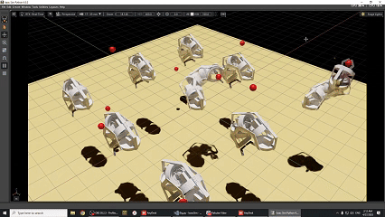

# Simulation for AGI Robot - TUES 2025
 
This will be the repository for the simulation of the AGI Robot

^ visualisation of the final training ^

For more info watch our video about the hole project:

---

#### Software Requirements:
- Isaac sim 4.5.0 python env
- Isaac lab 2.0.1
- Python 3.9.0
 

### Hardware Requirements:  
- 16+ GB of RAM
- NVIDIA GeForce RTX GPU (tested on rtx 3060, older could work?)
- 6+ logical cores
 
---

### Set for

- Old Unity simulation
    - Scripts
    - Scenes
    - Arm and Body models
    - Simulation Scripts (ML Traning)
    - Trained (although probably not wokring) brains for the Arm(s)

- Isaac Sim:
    - Test documentation

    - URDF / xacro files for the Robot
        - Arm (versions)

    - USD files for the Robot
        - Test scenes
        - Arm 

    - Scripts for the simulation
        - ML Training
        - Simulation scripts

